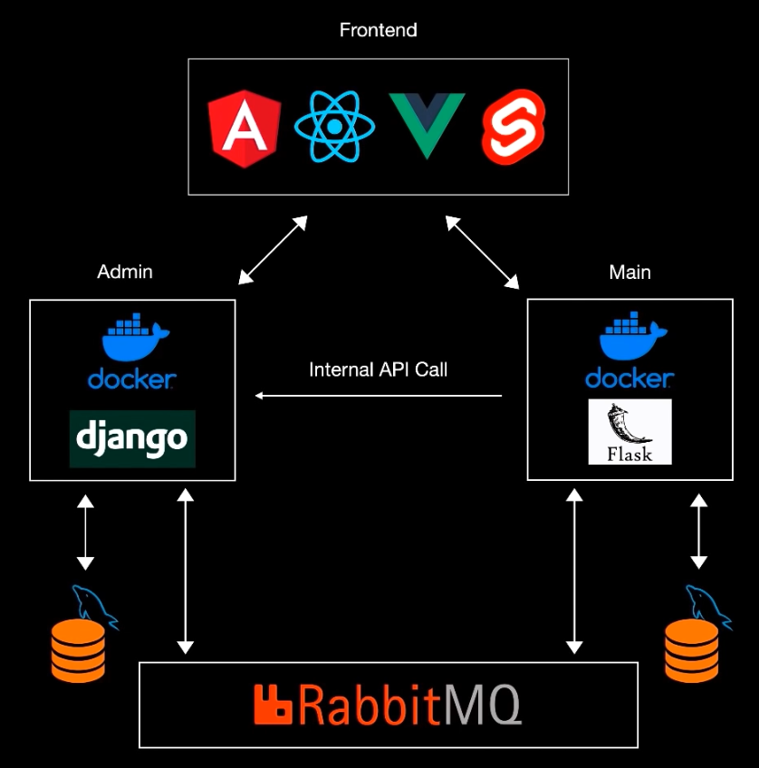

# Microservices Web App
Development of a Microservices Architecture App with React, Django and Flask. 

POC of an application using Microservices instead a Monolith Architecture.

Project Architecture:


## Admin app
Create a virtual env and:
```bash
pip install django
pip install djangorestframework
```

Start project:
```bash
django-admin startproject admin
```

Run the project by getting inside the directory admin and:
```bash
python manage.py runserver
```

### Create Docker files
#### Dockerfile
```dockerfile
FROM python:3.10.9
ENV PYTHONUNBUFFERED 1
# this env is useful to get logs so we can see whatever is happening
WORKDIR /app
COPY requirements.txt /app/requirements.txt
RUN pip install -r requirements.txt
COPY . /app/
# Copy all the files to the app directory

CMD python manage.py runserver 0.0.0.0:8000
```
---

#### docker-compose.yml
```yml
version: '3.8'
services:
  backend:
    build:
      context: .
      dockerfile: Dockerfile
    ports:
      - 8000:8000
    volumes:
      - .:/app
        # this .:/app means all the files will be connected with the docker container, everytime we make a change in the app it will pass it to the dockerfile /app and opposite too.
```

#### Create Docker container
```bash
docker compose up
```
and wait for it to be created.

#### Run Docker container
with same command:
```bash
docker compose up
```