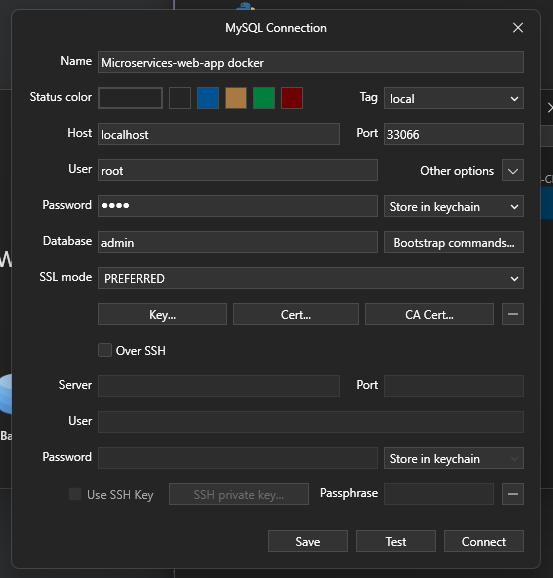

# Microservices Web App
Development of a Microservices Architecture App with React, Django and Flask. 

POC of an application using Microservices instead a Monolith Architecture.

Project Architecture:


## Admin app
Create a virtual env and:
```bash
pip install django
pip install djangorestframework
pip install django-cors-headers
pip install django-mysql
```

Start project:
```bash
django-admin startproject admin
```

Run the project by getting inside the directory admin and:
```bash
python manage.py runserver
```

---

### Create Docker files
#### Dockerfile
```dockerfile
FROM python:3.10.9
ENV PYTHONUNBUFFERED 1
# this env is useful to get logs so we can see whatever is happening
WORKDIR /app
COPY requirements.txt /app/requirements.txt
RUN pip install -r requirements.txt
COPY . /app/
# Copy all the files to the app directory

CMD python manage.py runserver 0.0.0.0:8000
```

#### docker-compose.yml
```yml
version: '3.8'
services:
  backend:
    build:
      context: .
      dockerfile: Dockerfile
    ports:
      - 8000:8000
    volumes:
      - .:/app
        # this .:/app means all the files will be connected with the docker container, everytime we make a change in the app it will pass it to the dockerfile /app and opposite too.
```

#### Create Docker container
```bash
docker compose up
```
and wait for it to be created.

#### Run Docker container
with same command:
```bash
docker compose up
```

---

### Connect Django with MySQL with Docker
At first, delete the [db.sqlite3](./admin//db.sqlite3) file created as default with Django, because we will be using MySQL

Then let's add new stuff to the [docker-compose.yml](./admin/docker-compose.yml)
```bash
...

    depends_on:
      - db

  db:
    image: mysql:8.3.0-oraclelinux8
    restart: always
    environment:
      MYSQL_DATABASE: admin
      MYSQL_USER: root
      MYSQL_PASSWORD: root
      MYSQL_ROOT_PASSWORD: root
    volumes:
      - .dbdata:/var/lib/mysql
    ports:
      - 33066:3306
```

Now run the container and will pull the new stuff.
Then you can connect to the db with TablePlus for example and using credentials specified on docker-compose:


---

### Create a new app 'Products' getting inside the docker container
```bash
# docker-compose exec <container> sh
docker-compose exec backend sh
```

then inside the container create the new app:
```bash
python manage.py startapp products
```

---
### Models & Serialization
[models.py](./admin/products/models.py)
```python
class Product(models.Model):
    title = models.CharField(max_length=200)
    image = models.CharField(max_length=200)
    likes = models.PositiveIntegerField(default=0)

class User(models.Model):
    pass
```
#### Generate Migrations
Inside the docker container run
```bash
python manage.py makemigrations
```

#### Run Migrations
```bash
python manage.py migrate
```